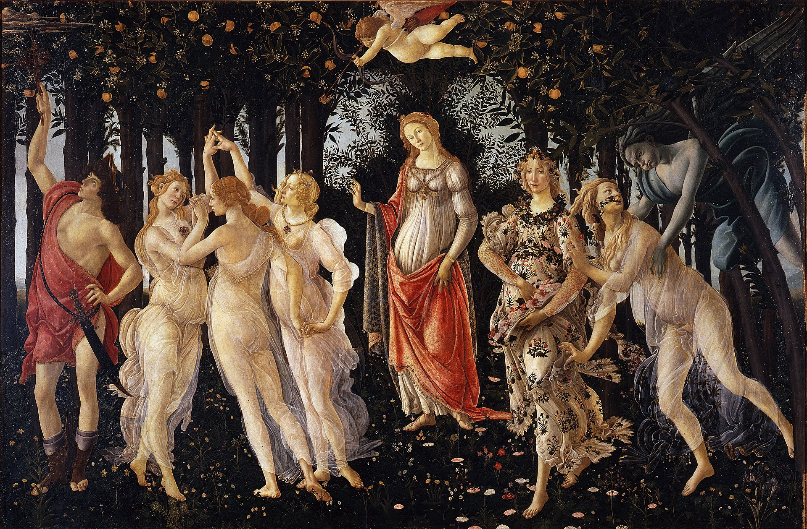
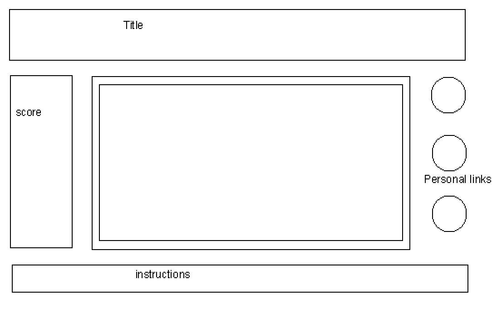

# Gottacelli

Gottacelli is a game based on the painting "Primavera" by Sandro Botticelli. The gameplay is simple: 
### A. Fly baby cupid through the grove to catch falling oranges before they hit the ground 
* arrow keys 
### B. Shoot heart arrows at the Graces when their hearts pulsate
* space key 
### C. Help Mercury keep away the oncoming winter clouds 
* a typed command or something else-- any ideas?

Other fun features could include commands or cursor interaction to make the Graces dance around, have Flora throw her flower petals, or change Venus' outfit. 

# Wireframes 

