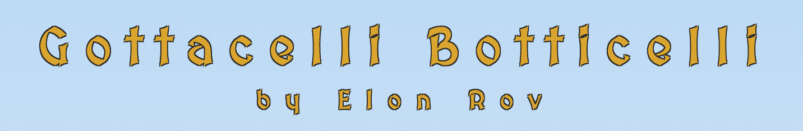
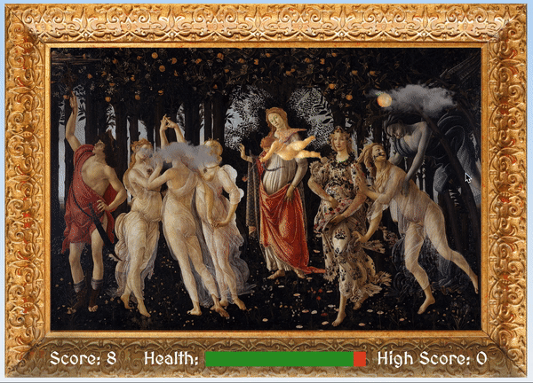

Gottacelli Botticelli is a game based on the painting "Primavera" by Sandro Botticelli. Fly cupid around the orange grove, avoiding the lingering winter clouds, being careful not to touch the ground. Score points by catching falling oranges. While Mercury fails to protect Flora from the winter chill, Cupid must help her make the most of the last days of spring.

Fly around using the arrow keys. Press "enter" to start and "m" to mute.  

Gottacelli was built using JavaScript's CanvasJS charting library. 

|  |  |
|----------------------------------------|------------------------------------|

|  |
|---------------------------------------|

