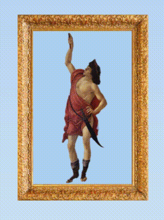

Gottacelli Botticelli is a game based on the painting "Primavera" by Sandro Botticelli. Fly cupid around the orange grove, avoiding the lingering winter clouds, being careful not to touch the ground. Score points by catching falling oranges. While Mercury fails to protect Flora from the winter chill, Cupid must help her make the most of the last days of spring.

Fly around using the arrow keys. Press "enter" to start and "m" to mute.  

Gottacelli was built using JavaScript's CanvasJS charting library. 

Moving Cupid: 
An event listener is set up for keydown and keyup on all four arrow keys. The image source is flipped from left-facing to right-facing depending on the direction the user wants to fly. 

 

Spinning 'museum panels': 
The CSS transform property was used to rotate two images simultaneously on the Y-axis. The backface-visibility property is used to display the front or back of the card as the user hovers or un-hovers over the card.

